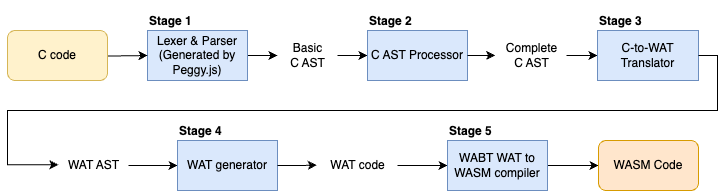

# ctowasm

A C compiler to Webassembly that runs natively in the browser and Node.js.

Read the compiler specification document here: [docs/ctowasm_1.0_compiler_specification.pdf](docs/ctowasm_1.0_compiler_specification.pdf)

## Developer Instructions

## Build

1. Run `yarn install` to install all dependencies.
2. Run `yarn build` to build the bundle. The bundled output files will be built in a folder called `dist`.

## Commands

Here are some commands you can run during development for testing and using ctowasm locally.

`yarn compile-run <C input filepath> [-o <output filepath>]` - compiles the C program specified by the filepath and immediately runs it in a Node.js environment. Any printing functions called within the compiled C program will display their print output in the terminal. The resultant Wasm module that was run is stored at the specified output filepath (_output/a.wat_ by default)

`yarn test` - Runs all Jest tests.

`yarn compile-wat <C input filepath> [-o <output filepath>]` - compiles the C program specified by the filepath into a Wasm in WAT format, and places output at specified output filepath (_output/a.wat_ by default)

`yarn compile <C input filepath> [-o <output filepath>]` - compiles the C program specified by the filepath into a Wasm module (in byte code), and places output at specified output filepath (_output/a.wasm_ by default)

`yarn gen-c-ast <C input filepath> [-o <output filepath>]` - Parses the C input program, and converts the AST generated by the parser module to JSON and stores the output in specified output filepath (_output/c-ast.json_ by default).

`yarn gen-p-c-ast <C input filepath> [-o <output filepath>]` - Parses the C input program and processes the parsed AST to generate a complete C AST, and converts this AST generated by the parser module to JSON and stores the output in specified output filepath (_output/c-processed-ast.json_ by default).

`yarn gen-wat-ast <C input filepath> [-o <output filepath>]` - generates the WAT AST for the input file, and converts it JSON and stores the output in the specified output filepath (_output/wat-ast.json_ by default).

## High-level Overview of Compiler Design

ctowasm is designed as a series of distinct modules in a pipeline. Each module takes in the output of the previous module as input and performs a specific compilation task, then passes that output to the next module. Here is a diagram showing each module in the pipeline.



Each module has a distinct folder in the [src](/src) directory, and a main _index.ts_ file.
Here is a brief description of each module:

1. Lexer & Parser
   Generated using Peggy.js (Peggy.js, n.d.), it lexes and parses the input C program, building a basic C Abstract Syntax Tree (AST) that contains all the information of the C source code.
2. C AST Processor
   Traverses the basic C AST and generates a complete final C AST, with much more information in each node.
3. C-to-WAT Translator
   Translates the complete C AST generated by the C AST processor into a WAT AST that contains nodes that have a can be converted into WAT nodes. (most nodes have a one-to-one correspondence).
4. WAT generator
   Traverses the WAT AST generated by the translator, converting each WAT AST node into its WAT counterpart S-expression string (since everything in a WAT is an S-expression). The resultant WAT S expression strings are compiled together to form a complete WAT module.
5. WABT WAT to WASM compiler
   While the other modules are custom-created for this project, this module consists of utilising the [web port](https://github.com/AssemblyScript/wabt.js/) of the [WebAssembly Binary Toolkit](https://github.com/WebAssembly/wabt). The original WebAssembly Binary Toolkit consists of a suite of tools for WebAssembly. Specifically, the functionality provided by wabt.js that is used in this module is the ability to compile WAT to WASM.

## Miscellaneous Instructions

### Adding new supported JavaScript functions

There is a framework for adding collections of JavaScript functions (we call them modules) that the Wasm module can dynamically link to at runtime using [Wasm imports](https://webassembly.org/getting-started/js-api/), allowing users to compile and run C programs that call these functions. This allows you to greatly expand what users can do with programs compiled using the compiler, such as interacting with external JavaScript libraries or browser APIs, or simply your own custom functions written in JavaScript. Please refer to the [src/modules](src/modules) folder to see how to use this framework, as it is rather straightforward. Each subfolder of [src/modules](src/modules) is a separate module. It is most helpful to refer to the [source_stdlib](src/modules/source_stdlib) module as that module is pure JavaScript (no use of Emscripten to compile C libraries to JavaScript modules - see next section).

### Adding new C libraries

You can use the same framework mentioned in the previous section to add C libraries that were compiled for the web using Emscripten. The modules [math](src/modules/math) and [utility](src/modules/utility) are examples of this. The steps for making a C library available in this project are:

1. Download and install Emscripten as per the [instructions](https://emscripten.org/docs/getting_started/downloads.html).
2. Create a C program file with the library name that you want to name the collection of functions as, containing the defined functions that you wish to make available in this project. If you are making functions from an external C library (separate header) you may simply add the include directive at the top of the C file and leave the rest blank. For example, if I want to make some functions from the "math.h" standard library available, I merely need to add `#include <math.h>` at the top of the file, and leave the rest of the file blank.
3. Run a command with this format:

```
emcc <library name>.c -sEXPORTED_FUNCTIONS=<function names> -sEXPORTED_RUNTIME_METHODS=ccall,cwrap -sMODULARIZE  -sSINGLE_FILE -o <library name>.js
```

- Replace the \<function names> with a comma delimited list of names of functions you wish to add, each prefixed with "\_".
- You may need to add other functions to \<function names> that you do not want to export such as `_malloc` and `_free` in order to make `malloc` and `free` available for calling in the JavaScript environment when you are defining the JavaScript functions that interact with your added functions. See an example of this in the qsort function defined in [src/modules/utility/index.ts](src/modules/utility/index.ts).
- Replace the \<library name> accordingly
- For the list of EXPORTED_RUNTIME_METHODS, you may need to add other runtime methods that Emscripten can export, depending on the types of functions you are adding. See the [Emscripten docs](https://emscripten.org/docs/porting/connecting_cpp_and_javascript/Interacting-with-code.html). The [utility](src/modules/utility) module is an example of where this was needed.

An example of the above command that was used to compile `math.h` functions to make available in the the "math" module:

```
emcc math.c -sEXPORTED_FUNCTIONS=_acos,_asin,_atan,_cos,_cosh,_sin,_sinh,_tan,_tanh,_exp,_log,_log10,_pow,_sqrt,_ceil,_floor -sEXPORTED_RUNTIME_METHODS=ccall,cwrap -sMODULARIZE  -sSINGLE_FILE -o math.js
```

An example of a more complex version of the above command that was used to compile `stdlib.h` functions for the "utility" module:

```
emcc utility.c -sEXPORTED_FUNCTIONS=_atoi,_atof,_abs,_labs,_rand,_bsearch,_qsort,_srand,_free,_malloc -sEXPORTED_RUNTIME_METHODS=ccall,cwrap,stringToNewUTF8,addFunction,wasmMemory -sMODULARIZE  -sSINGLE_FILE -sALLOW_TABLE_GROWTH -o utility.js
```

4. Move the resultant \<library name>.js file into this project repository, in the module folder. Ensure you define types for importing the functions from this js file in your \<module name>.ts file. See the folders of the [utility](src/modules/utility) and [math](src/modules/math) modules for examples.
